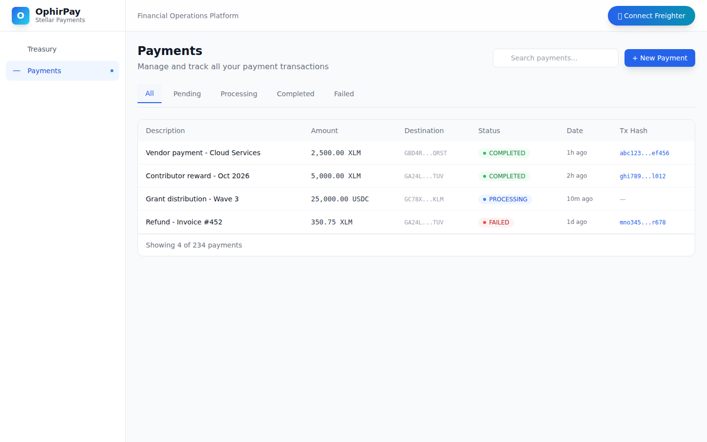

# OphirPay

**Stellar-native payment orchestration platform** — simplifies, automates, and provides visibility into blockchain-based payments for individuals, businesses, nonprofits, and DAOs.

Built on the [Stellar](https://stellar.org) network with [Soroban](https://soroban.stellar.org) smart contract support.

---

## 📋 Features

- **Wallet Connection** — Connect your Freighter wallet to Stellar Testnet with one click
- **Real-Time Balance** — View your XLM balance fetched live from the Stellar network
- **Send Payments** — Send XLM transactions on Testnet with Freighter signing, tx hash feedback, and explorer links
- **Payment Dashboard** — Track payment history, statuses, and transaction details
- **Batch Payments** — Process multiple payments in a single transaction with dynamic recipient management
- **Recurring Payments** — Schedule automated recurring payouts *(coming soon)*
- **Payment Requests** — Generate and share payment request links *(coming soon)*
- **Webhooks** — Real-time event notifications for external integrations *(coming soon)*
- **Analytics** — Payment volume, success rates, and financial insights *(coming soon)*

---

## 🛠 Tech Stack

| Layer | Technology |
|---|---|
| Frontend | [Next.js 15](https://nextjs.org) + TypeScript |
| Styling | [Tailwind CSS v4](https://tailwindcss.com) |
| Blockchain | [Stellar](https://stellar.org) + [Soroban](https://soroban.stellar.org) SDK v13 |
| Wallet | [Freighter](https://freighter.app) browser extension |
| Database | [Prisma](https://prisma.io) + SQLite |
| Network | Stellar Testnet |

---

## 🚀 Setup Instructions

### Prerequisites

- **Node.js** 18+ and **npm**
- [**Freighter Browser Extension**](https://freighter.app) installed in Chrome/Firefox
- A funded Stellar Testnet account (use [Stellar Friendbot](https://laboratory.stellar.org/#account-creator?network=test) to fund)

### 1. Clone the repository

```bash
git clone https://github.com/OphirPay/OphirPay.git
cd OphirPay
```

### 2. Install dependencies

```bash
npm install
```

### 3. Set up the database

```bash
npx prisma db push
npx prisma generate
```

### 4. Configure environment

Copy `.env.example` to `.env` (already provided with Testnet defaults):

```bash
cp .env.example .env
```

Default environment variables:

```env
DATABASE_URL="file:./dev.db"
NEXT_PUBLIC_STELLAR_NETWORK="TESTNET"
NEXT_PUBLIC_STELLAR_RPC_URL="https://soroban-testnet.stellar.org:443"
NEXT_PUBLIC_STELLAR_HORIZON_URL="https://horizon-testnet.stellar.org"
STELLAR_NETWORK_PASSPHRASE="Test SDF Network ; September 2015"
```

### 5. Run the development server

```bash
npm run dev
```

Open [http://localhost:3000](http://localhost:3000) in your browser.

---

## 📸 Screenshots

### Wallet Options Available

*Disconnected state showing the "Connect Freighter" button — users can see available wallet options before connecting:*


### Treasury Dashboard

*The main dashboard showing stats cards, connected wallet balance, recent payments table, and quick actions:*


### Payments List

*Payment history with search, filter tabs, status badges, and Stellar Explorer transaction links:*



### Send Payment

*Send XLM form with destination address, amount, memo, and real-time balance display:*


### Transaction Success

*After Freighter signs the transaction, the tx hash is shown with a link to Stellar Expert explorer:*


---

## 🌐 Live Demo

🚀 **[ophirpay.vercel.app](https://ophirpay.vercel.app)** — deployed on Vercel with automatic builds from `main`.

---

## 🔧 Project Structure

```
src/
├── app/                    # Next.js App Router pages
│   ├── layout.tsx          # Root layout (server component)
│   ├── page.tsx            # Treasury Dashboard
│   ├── send/page.tsx       # Send payment flow
│   ├── payments/page.tsx   # Payment history
│   ├── batches/page.tsx    # Batch listing + detail
│   ├── batches/new/page.tsx # New batch form
│   ├── recurring/page.tsx  # Recurring payments
│   ├── requests/page.tsx   # Payment requests
│   ├── webhooks/page.tsx   # Webhook management
│   ├── analytics/page.tsx  # Analytics dashboard
│   └── api/
│       ├── health/route.ts  # Health check endpoint
│       └── batches/route.ts # Batch CRUD API
├── components/             # Reusable UI components
│   ├── AppShell.tsx        # Client shell (wallet provider + layout)
│   ├── WalletButton.tsx    # Connect/disconnect + balance display
│   ├── Sidebar.tsx         # Navigation sidebar
│   ├── Header.tsx          # Top header bar
│   └── EmptyState.tsx      # Reusable empty state component
├── hooks/
│   └── useFreighter.tsx    # Wallet context + hook
├── lib/
│   ├── stellar.ts          # Stellar SDK config + helpers
│   ├── prisma.ts           # Prisma client singleton
│   └── utils.ts            # Formatting + utility functions
├── types/
│   └── index.ts            # Shared TypeScript types
prisma/
└── schema.prisma           # Database schema (8 models)
```

---

## 🧪 Smart Contract Development

### Deployed Contract

| Detail | Value |
|---|---|
| Contract ID | `CDPYJWGBQI3PDWF3Q47SFIXI35OC6A2ADVH5WWDHRGFSXTIJADNPL55W` |
| Network | Stellar Testnet |
| WASM Hash | `bf9500e70231177eaddd78e92f2a2b1c490d07040a3b72a2dc70b871c107cbd8` |
| Deploy TX | [`29879bd9...`](https://stellar.expert/explorer/testnet/tx/29879bd9ab20ddfa7f4dfaf5c01fafda59831272188dbfc00790181142577e80) |
| Init TX | [`18d91f40...`](https://stellar.expert/explorer/testnet/tx/18d91f40a897eec454f3fd5011b559d114cf20b453b7b69ff9e3a84496717621) |
| Owner | `GACZ7ZELCUC5YGJ6JHIVLEZNR3XKYKOVUWD6H3IRFPRZMALNUYJZQM2U` |
| Explorer | [View on Stellar Expert](https://stellar.expert/explorer/testnet/contract/CDPYJWGBQI3PDWF3Q47SFIXI35OC6A2ADVH5WWDHRGFSXTIJADNPL55W) |
| Stellar Lab | [View on Stellar Lab](https://lab.stellar.org/r/testnet/contract/CDPYJWGBQI3PDWF3Q47SFIXI35OC6A2ADVH5WWDHRGFSXTIJADNPL55W) |

### Contract Interaction

Interact with the deployed contract at **/contracts** in the OphirPay dashboard:

- `get_payment_count()` — Returns total payments stored on-chain
- `get_payment(id)` — Fetch a specific payment by ID
- `get_owner()` — Returns the contract owner address
- `create_payment(payer, payee, amount, tx_hash)` — Create a new payment record

### Building Locally

```bash
cd contracts/ophirpay
cargo build --target wasm32-unknown-unknown --release
```

Compiled WASM: `contracts/ophirpay/target/wasm32-unknown-unknown/release/ophirpay_contract.wasm`

### Deploy with Stellar CLI

```bash
stellar contract deploy \
  --wasm contracts/ophirpay/target/wasm32-unknown-unknown/release/ophirpay_contract.wasm \
  --source-account <SECRET_KEY> \
  --rpc-url "https://soroban-testnet.stellar.org:443" \
  --network-passphrase "Test SDF Network ; September 2015"
```

### Invoke Contract Functions

```bash
# Initialize the contract
stellar contract invoke \
  --id CDPYJWGBQI3PDWF3Q47SFIXI35OC6A2ADVH5WWDHRGFSXTIJADNPL55W \
  --source-account <SECRET_KEY> \
  --rpc-url "https://soroban-testnet.stellar.org:443" \
  --network-passphrase "Test SDF Network ; September 2015" \
  -- init --owner <OWNER_PUBLIC_KEY>

# Read payment count (simulate only, no tx fee)
stellar contract invoke \
  --id CDPYJWGBQI3PDWF3Q47SFIXI35OC6A2ADVH5WWDHRGFSXTIJADNPL55W \
  --source-account <SECRET_KEY> \
  --rpc-url "https://soroban-testnet.stellar.org:443" \
  --network-passphrase "Test SDF Network ; September 2015" \
  -- get_payment_count
```

---

## 📄 License

Open source — [MIT License](LICENSE)

---

**OphirPay** — Financial operations for the Stellar ecosystem.
