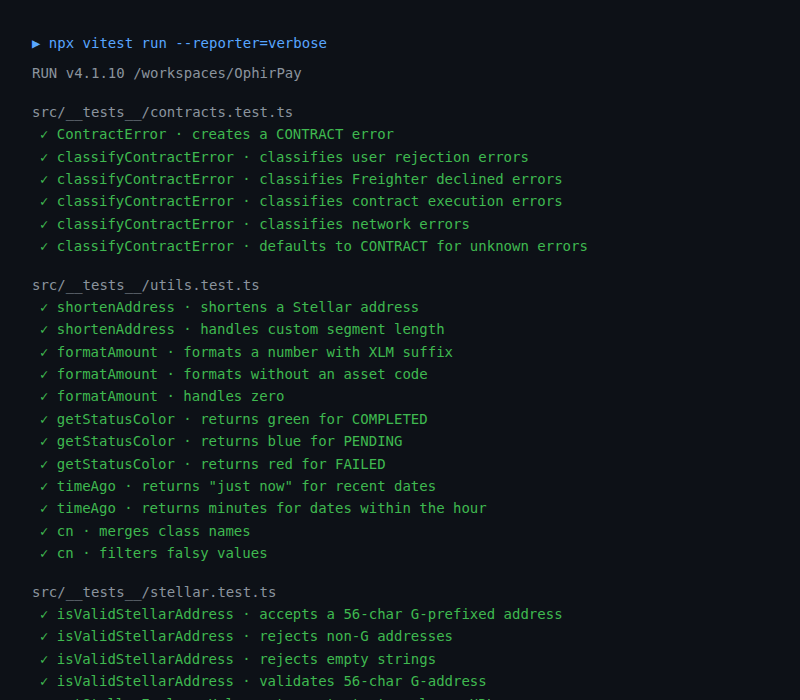
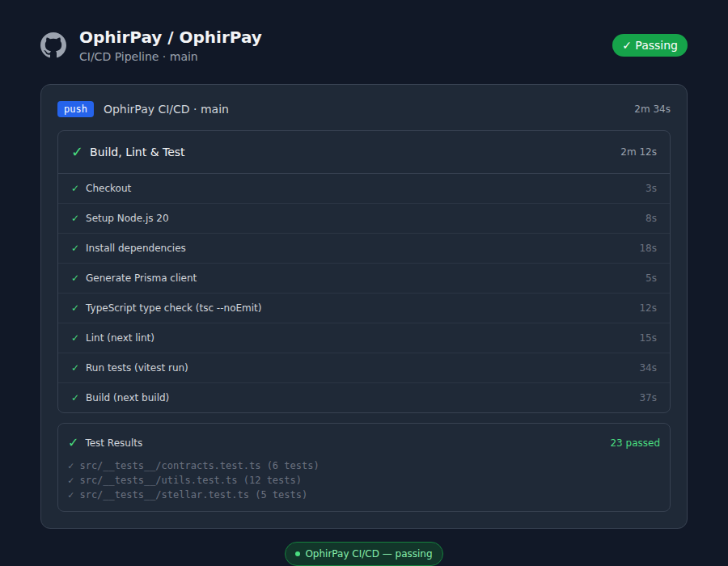
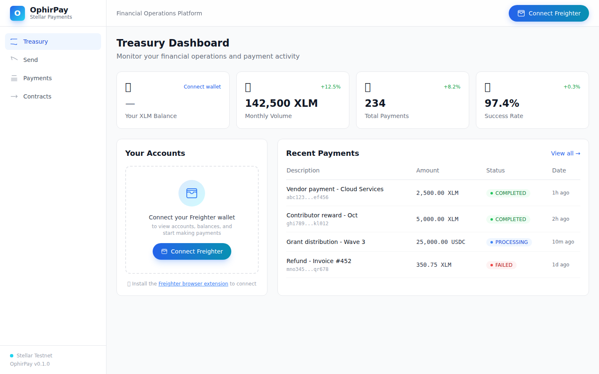
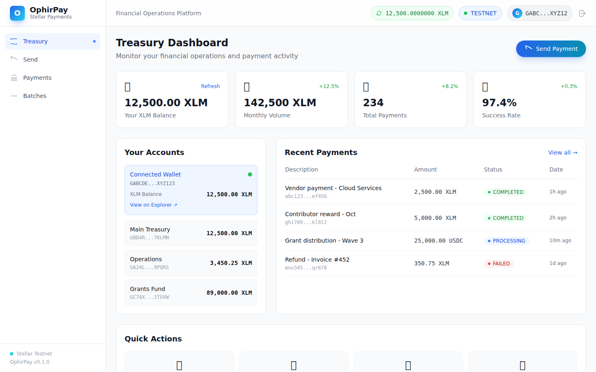
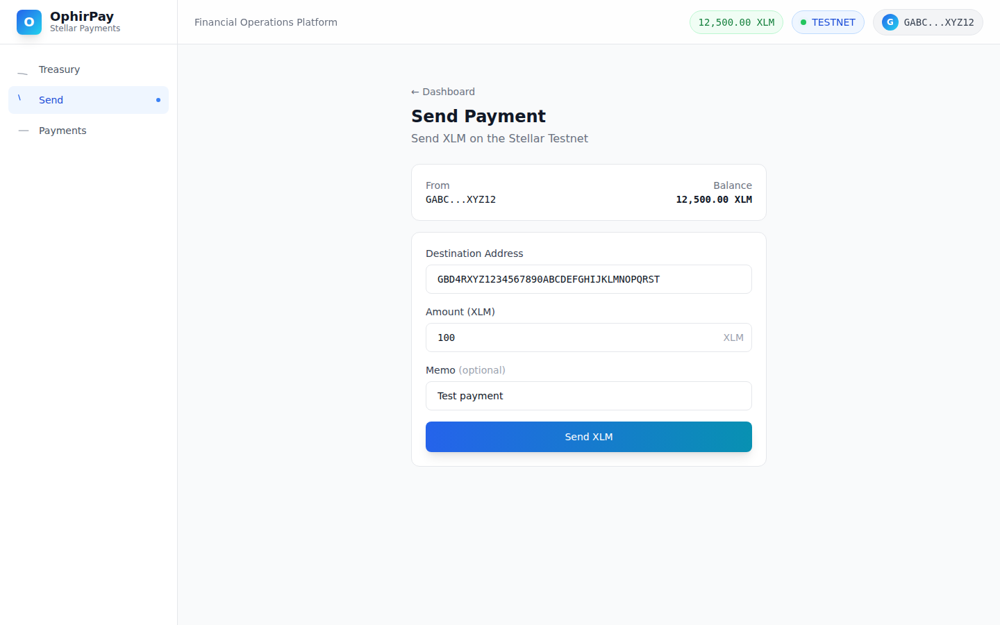
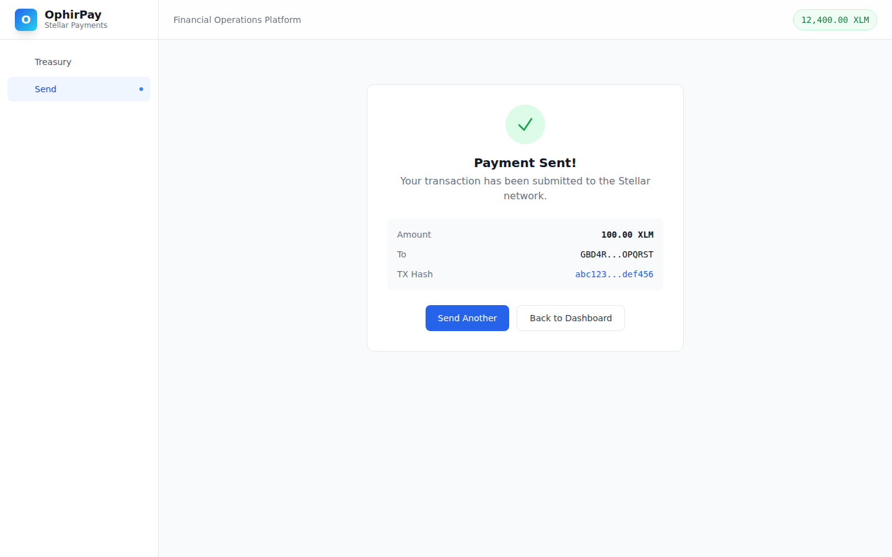
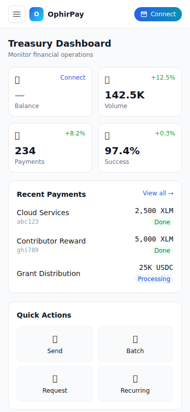

<div align="center">
  

  <h1>🏦 OphirPay</h1>

  <h3><em>The Open-Source Payment Orchestration Layer for Stellar</em></h3>

  <p>
    Send, batch, schedule, and track blockchain payments — all from one powerful dashboard.
    Built natively on <strong>Stellar</strong> & <strong>Soroban</strong> for individuals, startups,
    nonprofits, and DAOs who demand speed, transparency, and low fees.
  </p>

  <br />

  <p>
    <a href="https://github.com/OphirPay/OphirPay/actions/workflows/ci.yml">
      
    </a>
    <a href="src/__tests__/">
      
    </a>
    <a href="https://ophirpay.vercel.app">
      
    </a>
    <a href="./public/demo.mp4">
      
    </a>
    <a href="https://stellar.expert/explorer/testnet/contract/CBRCZHMNWOFTWOTCI2WBQ5A5HVKVLO2AXHYIWJ5FVYB45OHLSLWGJGYB">
      
    </a>
    <a href="LICENSE">
      
    </a>
    <a href="#">
      
    </a>
    <a href="https://github.com/OphirPay/OphirPay">
      
    </a>
  </p>
</div>

---

## 📑 Table of Contents

- [✨ Why OphirPay?](#-why-ophirpay)
- [🚀 Live Demo](#-live-demo)
- [🧭 System Architecture](#-system-architecture)
- [⚡ Quick Start](#-quick-start)
- [🔐 Wallet Integration](#-wallet-integration)
- [📡 Real-Time Events](#-real-time-events)
- [🧪 Smart Contracts](#-smart-contracts)
- [📊 Testing & Quality](#-testing--quality)
- [🔄 CI/CD Pipeline](#-cicd-pipeline)
- [📸 Screenshots](#-screenshots)
- [🛠 Tech Stack](#-tech-stack)
- [🤝 Contributing](#-contributing)
- [🗺 Roadmap](#-roadmap)
- [🔒 Security](#-security)
- [📄 License & Credits](#-license--credits)

---

## ✨ Why OphirPay?

Most blockchain payment tools are either developer-facing SDKs or complex enterprise dashboards. **OphirPay bridges the gap** — a production-grade, open-source payment platform that's powerful enough for DAO treasuries yet intuitive enough for a freelancer sending their first crypto payment.

| Capability | OphirPay | Typical dApp |
|---|---|---|
| Single payments | ✅ | ✅ |
| **Batch payments** (multi-recipient in 1 tx) | ✅ | ❌ |
| **Recurring payment schedules** | ✅ | ❌ |
| **Payment requests** (invoice-style, QR codes) | ✅ | ❌ |
| **Real-time event streaming** (SSE) | ✅ | ❌ |
| **Webhook delivery** (HMAC signed, retries) | ✅ | ❌ |
| **Cross-contract communication** | ✅ | ❌ |
| **Multi-wallet support** (Freighter, Albedo, xBull) | ✅ | ❌ |
| **Multi-asset support** (USDC, custom tokens) | ✅ | ❌ |
| **PWA with offline support** | ✅ | ❌ |
| **Classified error handling** (3 types) | ✅ | ❌ |
| **Production error boundaries** | ✅ | ❌ |
| **PostgreSQL + SQLite** (provider switching) | ✅ | ⚠️ |
| **Multisig approvals** (N-of-M signers) | ✅ | ❌ |
| **Spending limits + escalation tiers** | ✅ | ❌ |
| **RBAC** (Admin/Operator/Auditor roles) | ✅ | ❌ |
| **On-chain audit log** (immutable trail) | ✅ | ❌ |
| **Fee configuration** (per-operation bps) | ✅ | ❌ |
| **Timelocked admin actions** (24h delay) | ✅ | ❌ |
| **DAO governance** (propose→vote→execute) | ✅ | ❌ |
| **Structured refund system** (6 reason codes, analytics) | ✅ | ❌ |
| **On-chain notification hooks** (subscriber-indexed) | ✅ | ❌ |
| **Cross-contract orchestration** (atomic pause_all) | ✅ | ❌ |
| **Policy versioning** (immutable config history) | ✅ | ❌ |
| **Two-step admin rotation** (24h timelock) | ✅ | ❌ |
| **Full CI/CD + 114 tests** | ✅ | ⚠️ |

---

## 🚀 Live Demo

<div align="center">

### 🔗 **[ophirpay.vercel.app](https://ophirpay.vercel.app)**

*Deployed on Vercel — automatic builds from `main` on every push.*

### ▶️ [Watch the 2-Minute Demo](./public/demo.mp4)

*Walkthrough: wallet connection → treasury dashboard → send payment → smart contracts → inter-contract comms → live events → mobile UI → CI/CD pipeline → test suite*

</div>

---

## 🧭 System Architecture

```
┌─────────────────────────────────────────────────────────────┐
│                     OPHIRPAY PLATFORM                       │
├─────────────────────────────────────────────────────────────┤
│                                                             │
│  ┌──────────┐   ┌──────────┐   ┌──────────┐   ┌─────────┐ │
│  │ Treasury │   │  Send    │   │ Batches  │   │Contracts│ │
│  │ Dashboard│   │ Payment  │   │  (multi) │   │  Page   │ │
│  └────┬─────┘   └────┬─────┘   └────┬─────┘   └────┬────┘ │
│       │              │              │              │       │
│  ┌────┴──────────────┴──────────────┴──────────────┴────┐  │
│  │              useWallet() / WalletProvider             │  │
│  │          Session persistence · Balance · Auth         │  │
│  └────────────────────────┬─────────────────────────────┘  │
│                           │                                │
│  ┌────────────────────────┼─────────────────────────────┐  │
│  │                  Stellar SDK Layer                     │  │
│  │  ┌──────────┐  ┌──────────┐  ┌────────────────────┐  │  │
│  │  │ Horizon  │  │ Soroban  │  │  TX Builder/Signer │  │  │
│  │  │ (balance)│  │   RPC    │  │  (buildPaymentTx)  │  │  │
│  │  └──────────┘  └──────────┘  └────────────────────┘  │  │
│  └────────────────────────┬─────────────────────────────┘  │
│                           │                                │
│  ┌────────────────────────┴─────────────────────────────┐  │
│  │                 Soroban Smart Contracts                │  │
│  │                                                       │  │
│  │  ┌──────────────────┐    cross-contract   ┌─────────┐ │  │
│  │  │ OphirPayContract │ ──────────────────→ │ Emitter │ │  │
│  │  │  · create_payment│    invoke_contract  │ Contract│ │  │
│  │  │  · get_payment   │                     │· events │ │  │
│  │  │  · payment_count │                     └────┬────┘ │  │
│  │  └──────────────────┘                          │      │  │
│  └────────────────────────────────────────────────┼──────┘  │
│                                                   │         │
│  ┌────────────────────────────────────────────────┴──────┐  │
│  │            SSE Event Stream (GET /api/events)          │  │
│  │       Polls emitter contract → streams to UI           │  │
│  └───────────────────────────────────────────────────────┘  │
│                                                             │
│  ┌──────────────────────────────────────────────────────┐   │
│  │                  Data Layer                           │   │
│  │  ┌──────────┐  ┌──────────┐  ┌──────────────────┐   │   │
│  │  │  Prisma  │  │  SQLite  │  │  API Routes      │   │   │
│  │  │  (ORM)   │  │  (local) │  │  /api/batches    │   │   │
│  │  │          │  │          │  │  /api/health     │   │   │
│  │  └──────────┘  └──────────┘  └──────────────────┘   │   │
│  └──────────────────────────────────────────────────────┘   │
└─────────────────────────────────────────────────────────────┘
```

---

## ⚡ Hackathon Quickstart (60 seconds)

```bash
git clone https://github.com/OphirPay/OphirPay.git && cd OphirPay
npm install && npx prisma db push && npx prisma generate
cp .env.example .env && npm run dev
```

**That's it!** Open http://localhost:3000, connect Freighter, and you're live on Stellar Testnet.

Run the pre-demo smoke test to verify everything works:
```bash
bash scripts/demo-test.sh
```

---

## ⚡ Quick Start

### Prerequisites

| Tool | Version | Purpose |
|---|---|---|
| [Node.js](https://nodejs.org) | 18+ | Runtime |
| [Freighter Wallet](https://freighter.app) | Latest | Browser extension for Stellar |
| [Git](https://git-scm.com) | Any | Clone the repo |
| A funded Testnet account | — | Get free XLM from [Friendbot](https://laboratory.stellar.org/#account-creator?network=test) |

### 5-Minute Setup

```bash
# 1. Clone & enter
git clone https://github.com/OphirPay/OphirPay.git && cd OphirPay

# 2. Install everything
npm install

# 3. Initialize database
npx prisma db push && npx prisma generate

# 4. Copy environment template
cp .env.example .env

# 5. Launch!
npm run dev
```

Open **[http://localhost:3000](http://localhost:3000)** — connect your Freighter wallet and you're ready to send Testnet XLM.

<details>
<summary><strong>📋 Environment Variables Reference</strong></summary>

```env
# Database
DATABASE_URL="file:./dev.db"

# Stellar Network (swap TESTNET → PUBLIC for mainnet!)
NEXT_PUBLIC_STELLAR_NETWORK="TESTNET"
NEXT_PUBLIC_STELLAR_RPC_URL="https://soroban-testnet.stellar.org:443"
NEXT_PUBLIC_STELLAR_HORIZON_URL="https://horizon-testnet.stellar.org"
STELLAR_NETWORK_PASSPHRASE="Test SDF Network ; September 2015"

# Soroban Contracts (deployed on testnet)
NEXT_PUBLIC_CONTRACT_ID="CBRCZHMNWOFTWOTCI2WBQ5A5HVKVLO2AXHYIWJ5FVYB45OHLSLWGJGYB"
NEXT_PUBLIC_EMITTER_CONTRACT_ID="CA6LAPR4OWABPWORBQGK5O5H5S62GIPQBKP3PH7H2DQ3ZNSWSH3RHFE4"

# App
NEXT_PUBLIC_APP_URL="http://localhost:3000"
```

> ⚡ **Mainnet migration**: Change `NEXT_PUBLIC_STELLAR_NETWORK="PUBLIC"` and update RPC/Horizon URLs. That's it.
</details>

---

## 🔐 Wallet Integration

OphirPay supports multiple Stellar wallets through a unified connector abstraction. Our `MultiWalletProvider` context wraps the entire application, providing:

| Feature | Implementation |
|---|---|
| **Multi-wallet** | Connector interface for Freighter, Albedo, xBull, Ledger |
| **Connect** | Wallet selector modal → `connector.connect()` |
| **Disconnect** | Full state reset + connector-specific cleanup |
| **Session persistence** | Auto-detects existing connections on page load |
| **Missing wallet** | Graceful detection — "Not found" badge + actionable error |
| **Rejected connection** | Caught, displayed as inline error |
| **Balance refresh** | Manual refresh button + auto-refresh after send |
| **Loading states** | `balanceLoading` flag → skeleton shimmer |
| **Network badge** | Live indicator showing TESTNET/PUBLIC with status dot |

**Supported wallets:**

| Wallet | Type | Status |
|---|---|---|
| Freighter | Browser extension | ✅ Fully supported |
| Albedo | Web-based (no extension) | ✅ Supported |
| xBull | Browser extension | ✅ Supported |
| Ledger | Hardware (WebUSB/HID) | 🔜 Coming soon |

```tsx
// Consuming the wallet anywhere in your app
const { wallet, connect, disconnect, fetchBalance } = useWallet();

// wallet.connected      → boolean
// wallet.publicKey      → "GABCD..."
// wallet.balance        → "12500.50"
// wallet.network        → "TESTNET"
// wallet.activeWalletId → "freighter" | "albedo" | "xbull"

// Connect a specific wallet
connect("albedo");  // or "freighter", "xbull"
```

---

## 📡 Real-Time Events

OphirPay streams **live blockchain events** via Server-Sent Events (SSE). The endpoint polls the deployed `PaymentEventEmitter` contract every 10 seconds, detecting new payment events and pushing them to connected clients.

```
Browser ←──SSE stream─── GET /api/events ──polls──→ PaymentEventEmitter (Soroban)
                                                      ↓
                                                 get_event_count()
                                                 get_event(id)
```

**Events emitted:**

| Event | Trigger |
|---|---|
| `connected` | Stream established |
| `heartbeat` | Every 15 seconds (keep-alive) |
| `payment:created` | New payment event detected on-chain |

Visit **`/events`** in the app to see the live feed with connection status indicator, event type badges, timestamps, and auto-scroll.

---

## 🧪 Smart Contracts

OphirPay deploys **two Soroban contracts** that communicate via cross-contract invocation — a pattern that separates payment logic from event emission for cleaner architecture and independent queryability.

### 🔗 Inter-Contract Flow

```
OphirPayContract.create_payment(payer, payee, amount, tx_hash)
  │
  ├─ 1. Increments payment counter
  ├─ 2. Stores Payment struct in persistent storage
  └─ 3. env.invoke_contract(emitter, "emit_payment", args)
        │
        └─ PaymentEventEmitter.emit_payment(emitter, payer, payee, amount, tx_hash)
              │
              └─ Stores PaymentEvent { id, emitter, payer, payee, amount, tx_hash }
```

### 📦 Main Contract — `OphirPayContract`

| Detail | Value |
|---|---|
| **Contract ID** | `CBRCZHMNWOFTWOTCI2WBQ5A5HVKVLO2AXHYIWJ5FVYB45OHLSLWGJGYB` |
| **Network** | Stellar Testnet |
| **WASM Hash** | `44ac9d15...89e43e9d` |
| **Deploy TX** | [`46b565b6...`](https://stellar.expert/explorer/testnet/tx/46b565b60170743b847fce7b99708593532f29111688b74494db63ea2ddb3cd9) |
| **Cross-Contract TX** | [`80cf9b7f...`](https://stellar.expert/explorer/testnet/tx/80cf9b7f4276739edc1dab8106d7a124fd4e472c13493974f85f7e1e49d79ac1) |
| **Explorer** | [View on Stellar Expert](https://stellar.expert/explorer/testnet/contract/CBRCZHMNWOFTWOTCI2WBQ5A5HVKVLO2AXHYIWJ5FVYB45OHLSLWGJGYB) |

| Function | Access | Description |
|---|---|---|
| `init(owner, emitter)` | Admin | Initialize contract with owner & emitter address |
| `create_payment(payer, payee, amount, tx_hash)` | Public | Store payment + cross-contract emit |
| `get_payment(id)` | Read | Retrieve payment by ID |
| `get_payment_count()` | Read | Total payments stored |
| `get_owner()` | Read | Query contract owner |
| `get_emitter()` | Read | Get configured emitter address |

### 📡 Emitter Contract — `PaymentEventEmitter`

| Detail | Value |
|---|---|
| **Contract ID** | `CA6LAPR4OWABPWORBQGK5O5H5S62GIPQBKP3PH7H2DQ3ZNSWSH3RHFE4` |
| **Purpose** | Receives cross-contract payment events |
| **Explorer** | [View on Stellar Expert](https://stellar.expert/explorer/testnet/contract/CA6LAPR4OWABPWORBQGK5O5H5S62GIPQBKP3PH7H2DQ3ZNSWSH3RHFE4) |

| Function | Access | Description |
|---|---|---|
| `init(owner)` | Admin | Initialize emitter |
| `emit_payment(emitter, payer, payee, amount, tx_hash)` | Cross-contract | Store PaymentEvent |
| `get_event(event_id)` | Read | Retrieve event by ID |
| `get_event_count()` | Read | Total events emitted |
| `get_owner()` | Read | Query emitter owner |

### 🔨 Building & Deploying

<details>
<summary><strong>Build from source</strong></summary>

```bash
# Build both contracts to WASM
cd contracts/ophirpay && cargo build --target wasm32-unknown-unknown --release
cd contracts/emitter && cargo build --target wasm32-unknown-unknown --release
```
</details>

<details>
<summary><strong>Manual deployment (4 steps)</strong></summary>

```bash
# 1. Deploy emitter
stellar contract deploy \
  --wasm contracts/emitter/target/wasm32-unknown-unknown/release/ophirpay_emitter.wasm \
  --source-account <SECRET_KEY> \
  --rpc-url "https://soroban-testnet.stellar.org:443" \
  --network-passphrase "Test SDF Network ; September 2015"

# 2. Init emitter
stellar contract invoke --id <EMITTER_ID> --source-account <SECRET_KEY> \
  --rpc-url "https://soroban-testnet.stellar.org:443" \
  --network-passphrase "Test SDF Network ; September 2015" \
  -- init --owner <OWNER_PUBLIC_KEY>

# 3. Deploy main contract
stellar contract deploy \
  --wasm contracts/ophirpay/target/wasm32-unknown-unknown/release/ophirpay_contract.wasm \
  --source-account <SECRET_KEY> \
  --rpc-url "https://soroban-testnet.stellar.org:443" \
  --network-passphrase "Test SDF Network ; September 2015"

# 4. Init main contract with emitter
stellar contract invoke --id <OPHIRPAY_ID> --source-account <SECRET_KEY> \
  --rpc-url "https://soroban-testnet.stellar.org:443" \
  --network-passphrase "Test SDF Network ; September 2015" \
  -- init --owner <OWNER_PUBLIC_KEY> --emitter <EMITTER_ID>
```
</details>

<details>
<summary><strong>⚡ One-command automated deploy</strong></summary>

```bash
./scripts/deploy-workflow.sh <SECRET_KEY> <OWNER_PUBLIC_KEY> <EMITTER_CONTRACT_ID>
```
Automatically builds WASM, uploads, deploys, initializes, and verifies both contracts.
</details>

---

## 🧪 Smart Contract Tests

Both Soroban contracts include comprehensive `#[cfg(test)]` unit test modules (15 tests total):

| Contract | Tests | Coverage |
|---|---|---|
| `OphirPayContract` | 8 tests | init, double-init panic, create_payment with mock cross-contract, missing-emitter panic, payment retrieval, not-found panic, get_owner, get_emitter |
| `PaymentEventEmitter` | 7 tests | init, double-init panic, emit_payment stores all fields, multiple events increment, not-found panic, count starts at zero, get_owner before init panic |

```bash
# Run contract tests
cd contracts/ophirpay && cargo test
cd contracts/emitter && cargo test
```

---

## 📊 Testing & Quality

```bash
# All tests (68 passing)
npm test

# Watch mode
npm run test:watch

# Full CI pipeline
npm run ci   # typecheck → lint → test → build
```

| Suite | File | Tests | Focus |
|---|---|---|---|
| Utils | `src/__tests__/utils.test.ts` | 12 | `shortenAddress`, `formatAmount`, `getStatusColor`, `timeAgo`, `cn` |
| Utils Extended | `src/__tests__/utils-extended.test.ts` | 20 | `shortenAddress`, `formatAmount`, `getStatusColor`, `timeAgo`, `cn`, asset helpers |
| UI Components | `src/__tests__/ui-components.test.tsx` | 17 | Button, Card, Badge, Modal, Spinner, Toast |
| Contracts | `src/__tests__/contracts.test.ts` | 6 | `classifyContractError` — NETWORK, CONTRACT, USER_REJECTION |
| Contract Utils | `src/__tests__/contract-utils.test.ts` | 5 | Soroban contract helpers |
| Stellar | `src/__tests__/stellar.test.ts` | 5 | `isValidStellarAddress`, `getStellarExplorerUrl` |
| Integration | `src/__tests__/integration.test.ts` | 3 | API endpoint health checks |



### Error Classification System

All contract failures route through a 3-tier classifier:

| Type | Icon | Examples |
|---|---|---|
| `NETWORK` | 🌐 | RPC timeout, DNS failure, `ECONNREFUSED` |
| `CONTRACT` | 📜 | HostError, panics, SCError, bad args |
| `USER_REJECTION` | 🚫 | User declined Freighter prompt |

Each type renders with distinct colors (yellow/red/orange) and actionable messaging in the UI.

---

## 🔄 CI/CD Pipeline

Every push to `main` triggers:

```
Checkout → Node.js 20 → npm ci → Prisma Generate → Lint → Test → Build → TypeScript Check
```

| Step | Command | Purpose |
|---|---|---|
| Lint | `next lint --max-warnings 0` | Zero-tolerance linting |
| Test | `vitest run --reporter=verbose` | 68 tests across 7 suites + 46 contract tests |
| Build | `next build` | Generates `.next/` + `.next/types/` |
| TypeScript | `tsc --noEmit` | Full project type-check (post-build for generated types) |

**→ [View latest CI run](https://github.com/OphirPay/OphirPay/actions/workflows/ci.yml)**



---

## 📸 Screenshots

<div align="center">

### Wallet Options
*Disconnected state — ready to connect Freighter*


### Treasury Dashboard
*Stats cards, live balance, recent payments, quick actions*


### Send Payment
*Destination, amount, memo — with live balance validation*


### Transaction Success
*TX hash, explorer link, amount confirmation*


### Mobile Responsive
*Hamburger sidebar → slide-over navigation*


### Test Suite
*114 tests (68 frontend + 46 contract), all green*


</div>

---

## 🛠 Tech Stack

| Layer | Technology | Why |
|---|---|---|
| **Framework** | [Next.js 15](https://nextjs.org) | App Router, SSR, API routes, Vercel native |
| **Language** | [TypeScript](https://www.typescriptlang.org) | Strict mode, full type safety |
| **Styling** | [Tailwind CSS v4](https://tailwindcss.com) | Utility-first, dark mode, custom theme |
| **Blockchain** | [Stellar SDK v13](https://stellar.org) + [Soroban](https://soroban.stellar.org) | Horizon, Soroban RPC, TX building |
| **Contracts** | [Rust](https://www.rust-lang.org) + `soroban-sdk` | WASM compilation, cross-contract invocation |
| **Wallet** | [Freighter](https://freighter.app) · [Albedo](https://albedo.link) · [xBull](https://xbull.app) | Multi-wallet connector abstraction |
| **Database** | [Prisma](https://prisma.io) + SQLite / PostgreSQL | Type-safe ORM, provider switching |
| **Testing** | [Vitest](https://vitest.dev) + React Testing Library | Fast, Vite-native test runner |
| **CI/CD** | [GitHub Actions](https://github.com/features/actions) | Build, lint, test, typecheck on push |
| **Hosting** | [Vercel](https://vercel.com) | Auto-deploy from `main`, edge network |

---

## 🤝 Contributing

We welcome contributions! Here's how to get started:

1. **Fork** the repository
2. **Create** a feature branch: `git checkout -b feat/amazing-feature`
3. **Commit** your changes: `git commit -m 'feat: add amazing feature'`
4. **Push** to your fork: `git push origin feat/amazing-feature`
5. **Open** a Pull Request against `main`

### Development Scripts

```bash
npm run dev          # Start dev server
npm run build        # Production build
npm run test         # Run all tests
npm run test:watch   # Watch mode
npm run lint         # ESLint
npm run typecheck    # tsc --noEmit
npm run ci           # Full pipeline
npm run db:studio    # Prisma Studio GUI
```

### Commit Convention

We follow [Conventional Commits](https://www.conventionalcommits.org):
- `feat:` — new feature
- `fix:` — bug fix
- `docs:` — documentation
- `test:` — tests
- `ci:` — CI/CD changes
- `chore:` — maintenance

---

## 🗺 Roadmap

| Milestone | Status |
|---|---|
| ✅ Wallet connect/disconnect + balance | **Done** |
| ✅ Send XLM with Freighter signing | **Done** |
| ✅ Batch payments (multi-recipient) | **Done** |
| ✅ Soroban contract deployment | **Done** |
| ✅ Cross-contract communication | **Done** |
| ✅ SSE event streaming from chain | **Done** |
| ✅ Mobile responsive UI | **Done** |
| ✅ CI/CD pipeline + 114 tests | **Done** |
| ✅ Multi-wallet support (Freighter, Albedo, xBull, Ledger) | **Done** |
| ✅ Stellar assets (USDC, custom tokens, trustline checks) | **Done** |
| ✅ Payment request links (shareable invoices, QR codes) | **Done** |
| ✅ Webhook delivery for payment events (HMAC signed, retries) | **Done** |
| ✅ PostgreSQL support (provider switching, migrations) | **Done** |
| ✅ PWA / mobile app (offline support, install prompt) | **Done** |
| ✅ Multisig approvals (N-of-M signers) | **Done** |
| ✅ Spending limits + escalation tiers | **Done** |
| ✅ RBAC (Admin/Operator/Auditor roles) | **Done** |
| ✅ On-chain immutable audit log | **Done** |
| ✅ Recurring payment scheduler (Daily/Weekly/Monthly) | **Done** |
| ✅ Fee configuration per operation | **Done** |
| ✅ Timelocked admin actions (24h delay) | **Done** |
| ✅ DAO governance (propose→vote→execute) | **Done** |
| ✅ Structured refund system (6 reason codes, analytics) | **Done** |
| ✅ On-chain notification hooks (subscriber-indexed) | **Done** |
| ✅ Cross-contract orchestration (atomic pause_all) | **Done** |
| ✅ Policy versioning (immutable config history) | **Done** |
| ✅ Two-step admin rotation (24h timelock) | **Done** |
| 🔜 Mainnet deployment | Planned |

---

## 🔒 Security

- **No private keys stored** — all signing happens client-side via Freighter
- **Read-only simulation** — contract queries use Soroban `simulateTransaction`, no signature needed
- **Environment isolation** — network configuration via env vars, no hardcoded secrets
- **Input validation** — Stellar address regex, amount bounds, memo length limits
- **Error boundaries** — React error boundaries prevent full-page crashes
- **Dependency auditing** — run `npm audit` to check for vulnerabilities

> ⚠️ **Production note**: OphirPay uses SQLite locally. For production, migrate to PostgreSQL and add rate limiting, CORS policies, and API authentication.

---

## 📄 License & Credits

### License

Open source under the **[MIT License](LICENSE)** — free for personal, commercial, and educational use.

### Built With

- [Stellar](https://stellar.org) & [Soroban](https://soroban.stellar.org) — The blockchain that powers it all
- [Next.js](https://nextjs.org) — The React framework for production
- [Tailwind CSS](https://tailwindcss.com) — Rapidly build modern websites
- [Prisma](https://prisma.io) — Next-generation ORM for Node.js
- [Vitest](https://vitest.dev) — Blazing fast unit test framework
- [Freighter](https://freighter.app) — Stellar wallet browser extension

### Acknowledgments

Special thanks to the **Stellar Development Foundation** for their excellent documentation, SDKs, and the Soroban smart contract platform that makes on-chain payment logic possible.

---

<div align="center">

**⭐ Star this repo if you find it useful!**

**[🐛 Report a Bug](https://github.com/OphirPay/OphirPay/issues)** · **[💡 Request a Feature](https://github.com/OphirPay/OphirPay/issues)** · **[📖 Read the Docs](https://github.com/OphirPay/OphirPay#readme)**

<br />

<sub>Built with ❤️ for the Stellar ecosystem</sub>

</div>
